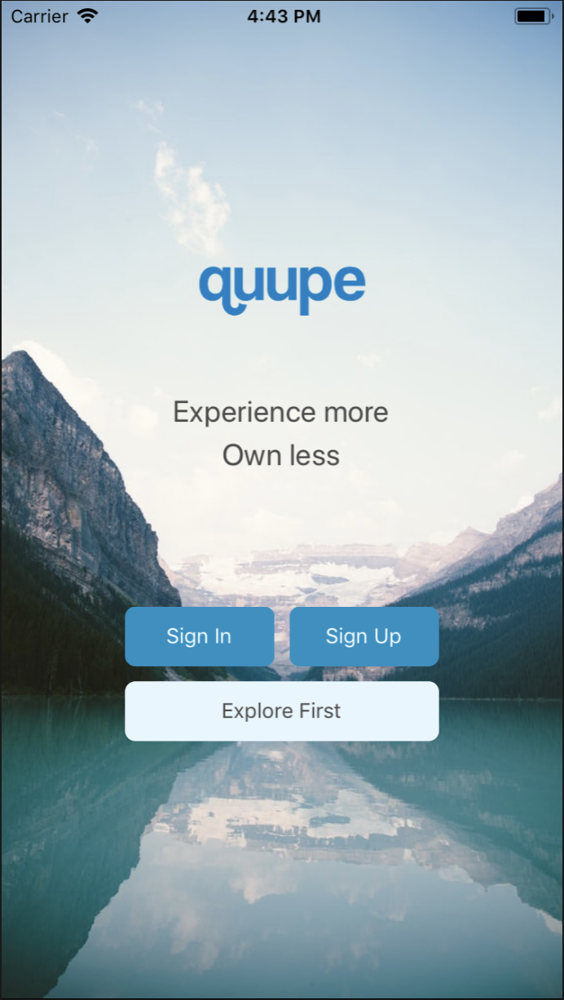
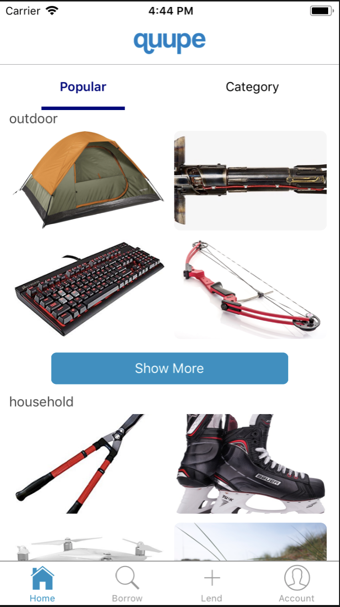
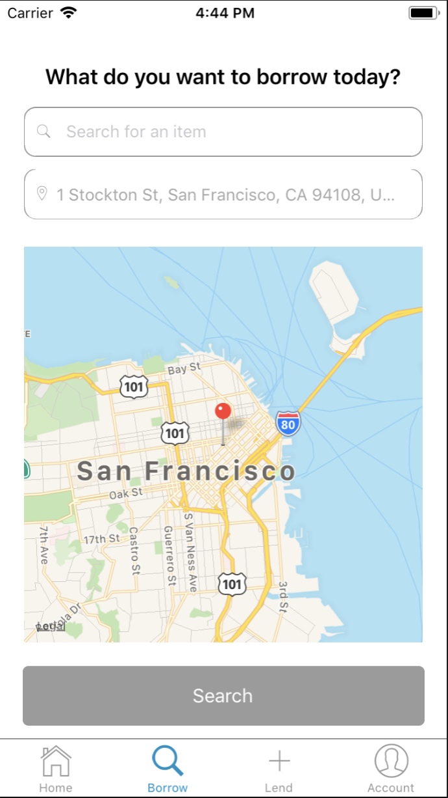
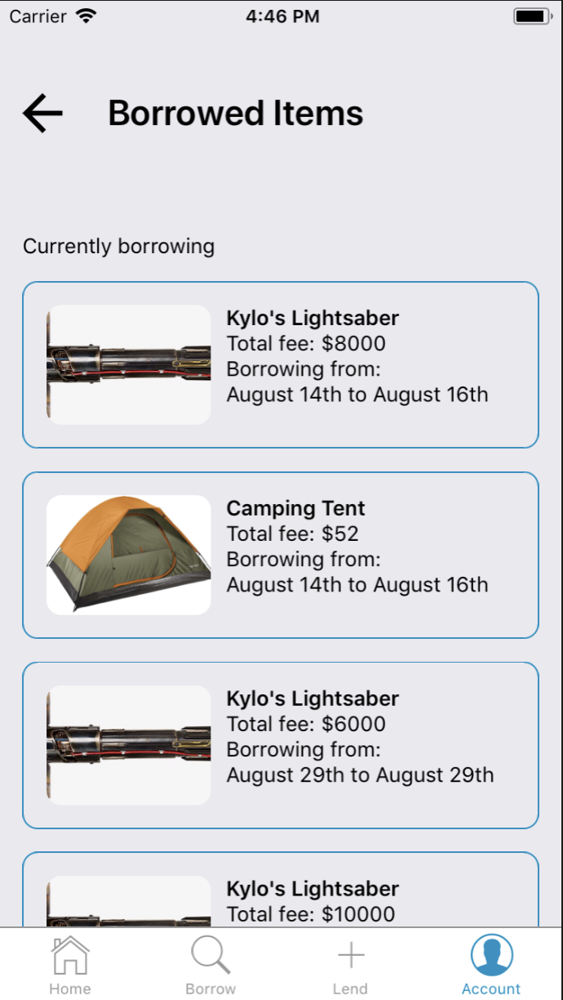

# Quupe
Quupe is an items sharing app built in React Native. The app uses Redux for state management, and Apollo Client and GraphQL for data fetching. On the back end, the app is built on Graphcool which handles functionality for user authentication, as well as Realm for storing the login token.

## Components Used

- React Native Calendars: https://github.com/wix/react-native-calendars
- React Native fbsdk: Used for having optional facebook login (feature is unfinished on the backend however) https://github.com/facebook/react-native-fbsdk
- Material UI: For styling https://material-ui.com/
- RN Modal Overlay: For overlay screens. https://github.com/rgabs/react-native-modal-overlay

## Installation

- Download ZIP & Unzip
- `cd /quupe-RN` and run `react-native run-ios`
- `cd/quupe-server` and run `yarn start`

